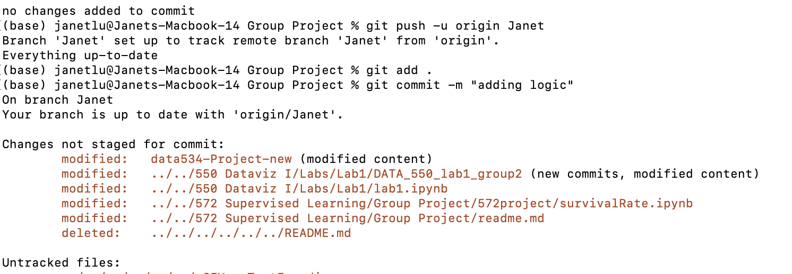
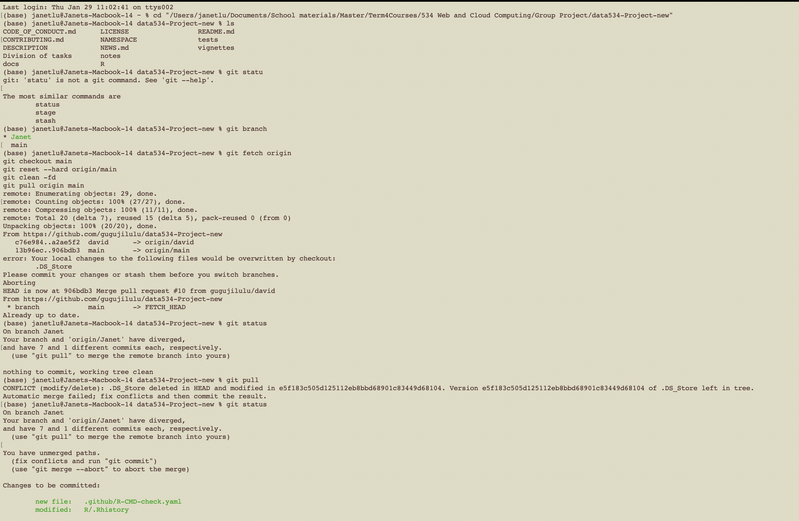
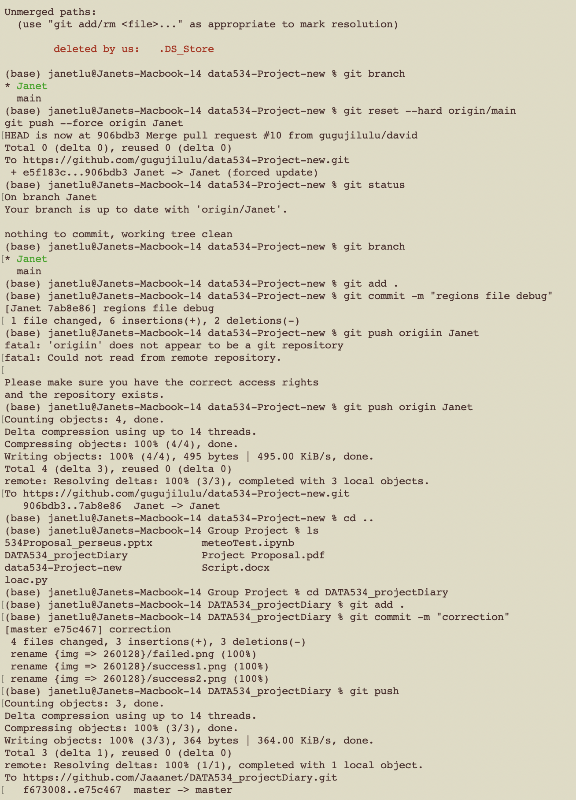
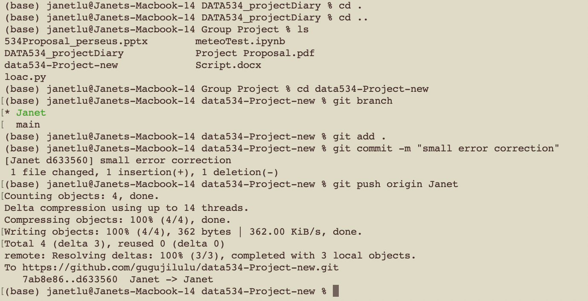
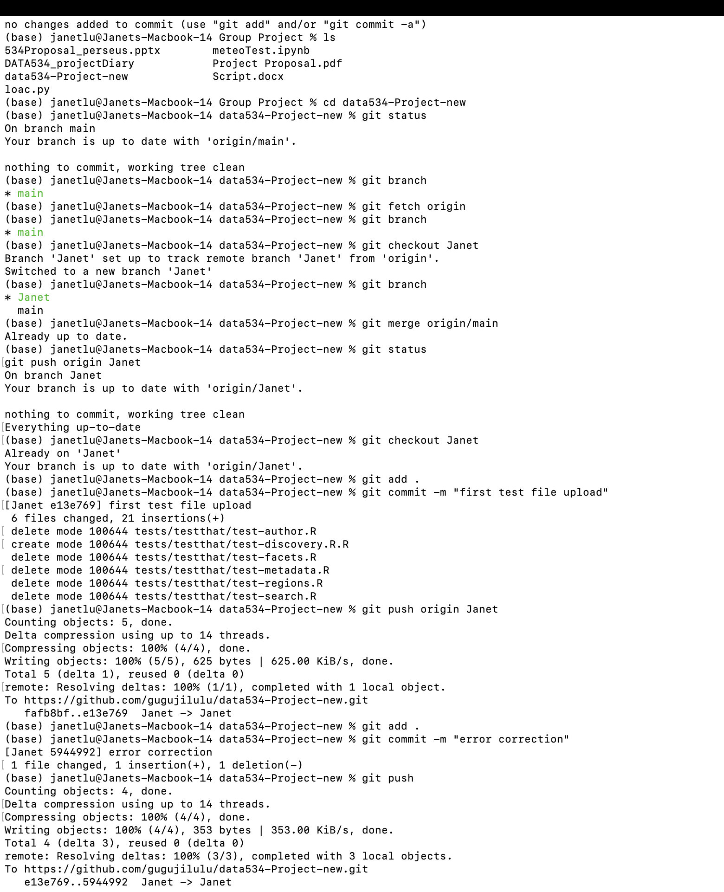
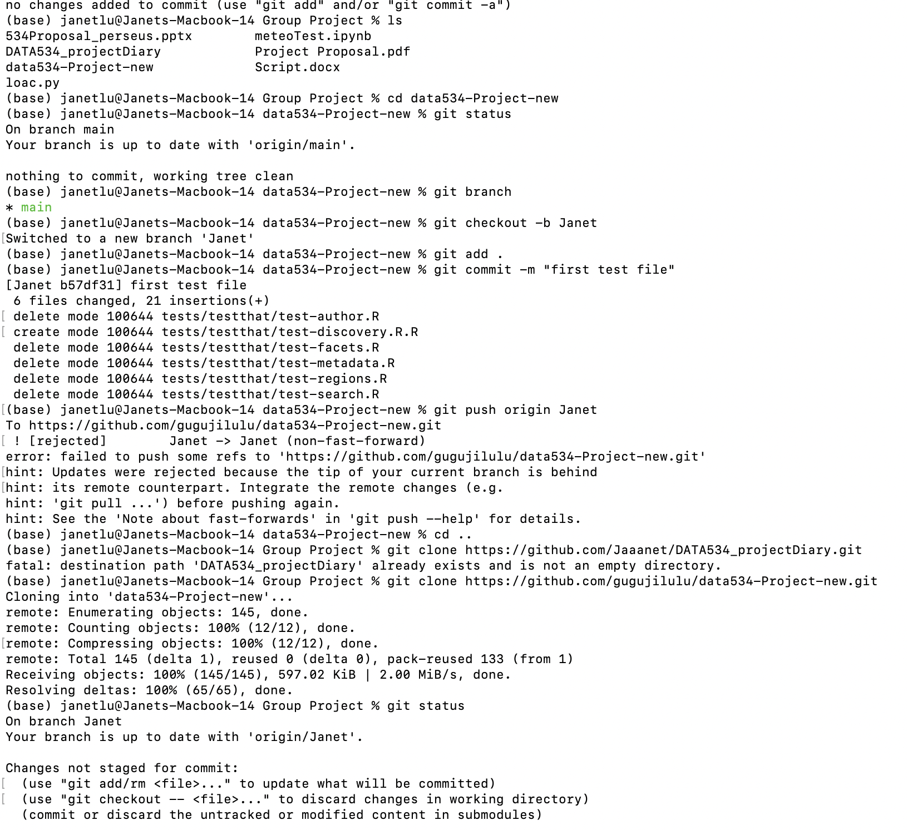

# Worklog — perseusR Project

## Date: 2026-01-28

### Summary

So I started with setting the local working repo today from what my group member created on github.\
The problem I encountered was that I forgot to work inside the directory and create a branch. I realized half-way of my coding today, I took screenshot of my failed git push and the successed part.

------------------------------------------------------------------------

### Tasks Completed

-   Coding `perseus_facets` and `perseus_regions`

------------------------------------------------------------------------

### Files / PRs Affected

-   `R/perseus_facets.R`
-   `R/perseus_regions.R`

------------------------------------------------------------------------

### Screenshots / Evidence

**Image1** \
**Image2** \
**Image3** \

------------------------------------------------------------------------

## Date: 2026-01-29

### Summary

So, today's focus was to build the testing files, however, before getting to the build the testing files, there was some issues with the `perseus_regions` file, there was a typo the I just realized this morning, because the merge from yester had failure that I did not notice.\
So, I had fix that. Then, there was some conflicts on github that I had to fix, me and my group member tried different method, then I had to try to delete the cloned repo and re-clone it for a few times. Everythin worked out at the end. So that I was able to push the testing files successfully at the end.

------------------------------------------------------------------------

### Tasks Completed

-   Correct typo error in `perseus_regions`
-   To fix conflicts happend on github
-   Manage to finish testing files

------------------------------------------------------------------------

### Screenshots / Evidence

**Image1** \
**Image2** \
**Image3** \
**Image4** \
**Image5** \

---
## *Date:* 2026-02-01  
# *Author:* David、Janet（Because of collaborative development, we shared the same log for this section）

## Summary
Today we completed a major update to the three core plotting functions so they support BOTH:
- a single query string (e.g., "war")
- a character vector of queries merged into ONE plot (e.g., c("Πλάτων","Plato","tlg0059"))

The plotting pipeline now aggregates multiple query entry points into a pooled CTS-URN set, enriches metadata once, then plots from one unified table.
---

## What changed (high level)

### 1) Multi-query → one plot (all three plot functions)

Previously the plot functions behaved as “single query only” because of checks like: - stopifnot(is.character(query), length(query) == 1, ...)

Now the behavior is: - accept query as a character vector - qs \<- unique(query) - run perseus_search() for each q - merge results with dplyr::bind_rows() - deduplicate by urn BEFORE metadata (critical for stability)

This removed the need for manual user-side boilerplate to combine queries.

------------------------------------------------------------------------

## Confirmed behaviors / examples

### A) Single query still works (baseline)

```         
perseus_plot_author_language_level("war")
perseus_plot_publication_timeline("war")
perseus_plot_concentration("war", role="publisher")
perseus_plot_concentration("war", role="editor")
perseus_plot_concentration("war", role="translator")
```

### B) Multi-query merged into one plot (new capability)

1)  Author × Language (multi query)

    perseus_plot_author_language_level(c("Πλάτων","Plato","tlg0059"))

Confirmed: - One plot rendered - Greek / Latin appear in the same stacked bars - No length(query)==1 errors after reinstall + reload

2)  Publication timeline (multi query, pooled)

    perseus_plot_publication_timeline(c("Πλάτων","Plato","tlg0059"))

Confirmed: - Density curves rendered - Multiple year peaks visible when metadata contains extractable years - No split by edition / translation (pooled by design in current implementation)

3)  Concentration (multi query, all roles)

    perseus_plot_concentration(c("Πλάτων","Plato","tlg0059"), role="publisher") perseus_plot_concentration(c("Πλάτων","Plato","tlg0059"), role="editor") perseus_plot_concentration(c("Πλάτων","Plato","tlg0059"), role="translator")

Confirmed: - Top-N + long-tail plots rendered - Role-specific cleaning behaves as expected - Plot titles are simplified (no parameter-heavy headers)

------------------------------------------------------------------------

## Key debugging observations recorded today

### 1) Query coverage is not symmetric across languages

"justice" returned 0 rows: res1 \<- perseus_search("justice", n = 200) nrow(res1) Result: 0

Greek input worked immediately: res2 \<- perseus_search("Πλάτων", n = 200) nrow(res2) Result: 20

Practical takeaway: For author-centric exploration, Greek names or canonical IDs often produce better coverage than English topical keywords.

### 2) “Works after reinstall” effect (loaded old build before reinstall)

A multi-query call initially failed with: - length(query) == 1 is not TRUE

After: devtools::document() devtools::install() library(perseuswrapR)

Then: getAnywhere("perseus_plot_author_language_level") perseus_plot_author_language_level(c("Πλάτων","Plato","tlg0059"))

worked.

Interpretation: The installed library initially pointed to an older build; reinstall ensured the updated function definition was loaded.

### 3) Detach error

This command produced: detach("package:perseuswrapR", unload = TRUE, character.only = TRUE)

Error: invalid 'name' argument

Likely cause: The package wasn’t attached under that exact name at the moment of detach, or the session state differed due to devtools load/install cycles.

------------------------------------------------------------------------

## Testing checklist used (before pushing)

1)  Confirm library path and version

    library(perseuswrapR) cat("loaded from:", find.package("perseuswrapR"), "\n") cat("version:", as.character(packageVersion("perseuswrapR")), "\n")

2)  Verify search + CTS URNs baseline

    res \<- perseus_search("war", n = 200) cat("search rows:", nrow(res), "\n") cat("urn starts with <urn:cts>:", sum(!is.na(res$urn) & grepl("^urn:cts:", res$urn)), "\n")

3)  Verify metadata shape and level distribution

    urns \<- unique(res$urn[!is.na(res$urn) & grepl("\^<urn:cts>:", res$urn)])
     meta <- perseus_metadata(utils::head(urns, 60))
     cat("meta rows:", nrow(meta), "meta cols:", ncol(meta), "\n")
     print(table(trimws(meta$level), useNA = "ifany"))

4)  Run all three plots on:

-   "war" (baseline)
-   c("Πλάτων","Plato","tlg0059") (multi-query merged)

------------------------------------------------------------------------

## Repo changes staged for commit (from git status)

Modified: - DESCRIPTION - R/perseus_plots.R - man/perseus_plot_author_language_level.Rd - man/perseus_plot_concentration.Rd - man/perseus_plot_publication_timeline.Rd

Deleted old tests: - tests/testthat/test-discovery.R.R - tests/testthat/test-metadata.R - tests/testthat/test-structure.R

Added new tests: - tests/testthat/test-wrapper-core.R - tests/testthat/test-metadata-cleaning.R - tests/testthat/test-plots.R

------------------------------------------------------------------------

## Result

Plotting now supports BOTH: - single term → one plot - multiple terms (Greek / English / canonical IDs) → one merged plot

This reduces user friction and makes the plotting layer behave like a query aggregator for structural exploration.
