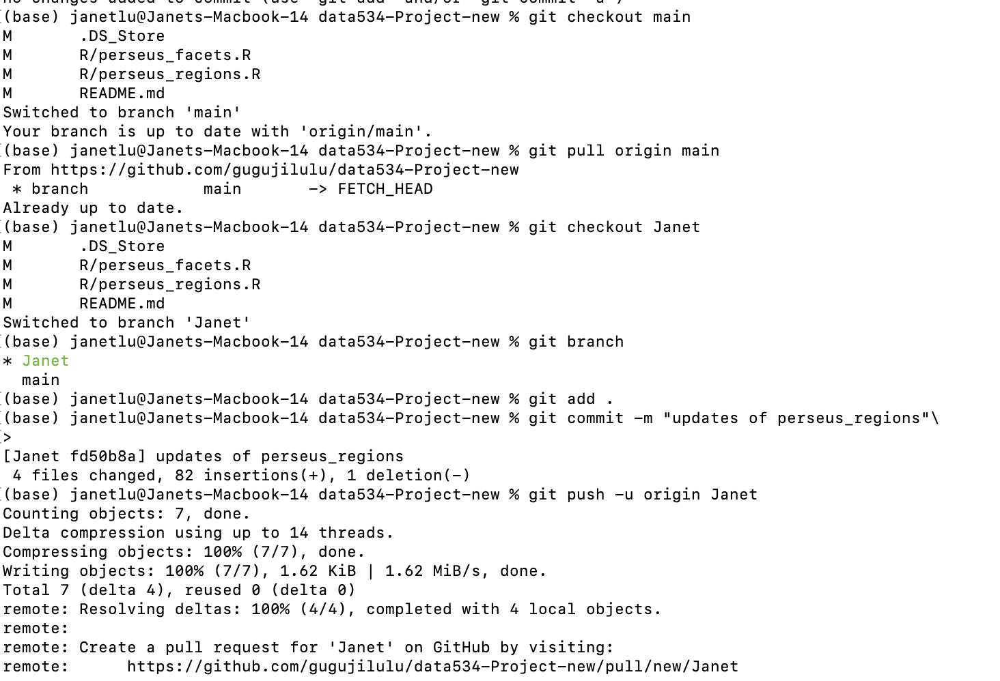
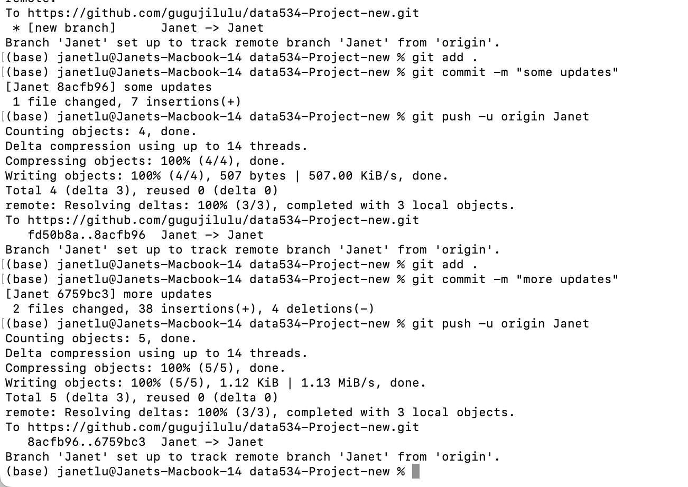

# Worklog — perseusR Project

## Date: 2026-01-28

### Summary
So I started with setting the local working repo today from what my group member created on github.  
The problem I encountered was that I forgot to work inside the directory and create a branch. I realized half-way
of my coding today, I took screenshot of my failed git push and the successed part. 

---

### Tasks Completed
- Coding `perseus_facets` and `perseus_regions`

---

### Files / PRs Affected
- `path/to/file1.R`
- `path/to/file2.R`

---

### Screenshots / Evidence
**Image1**
\
**Image2**
\
**Image3**
\

